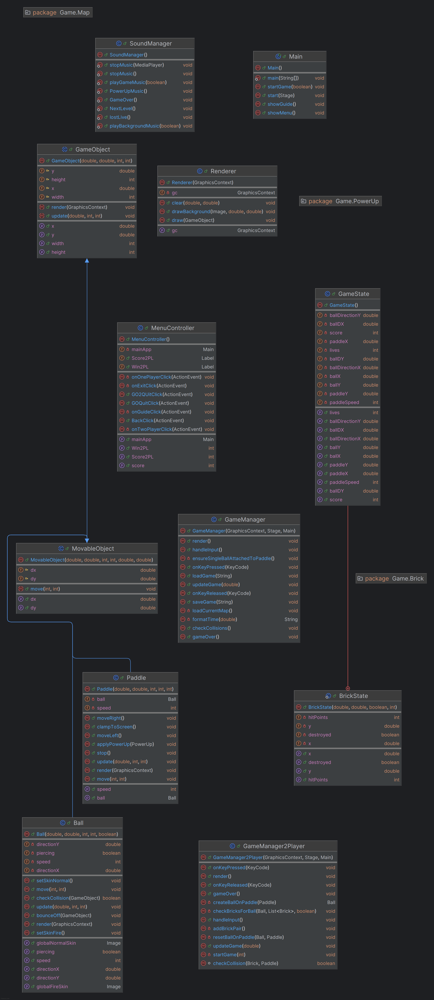
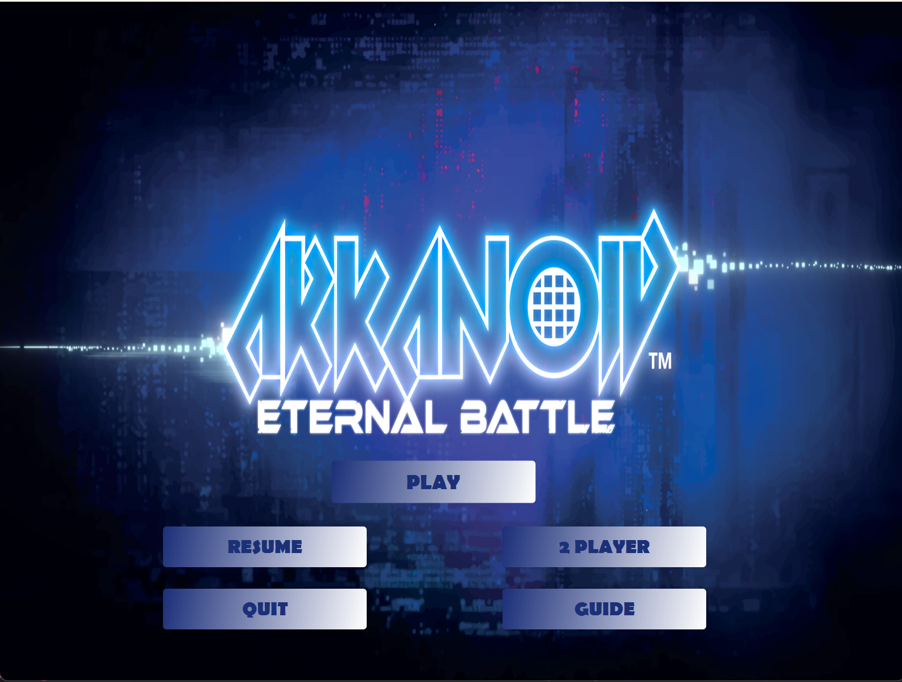
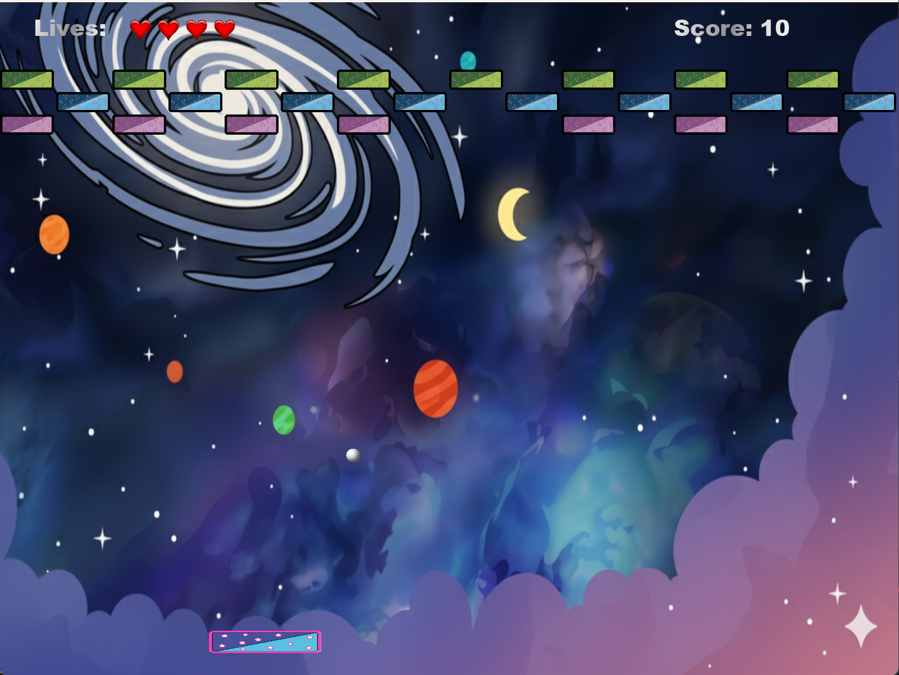
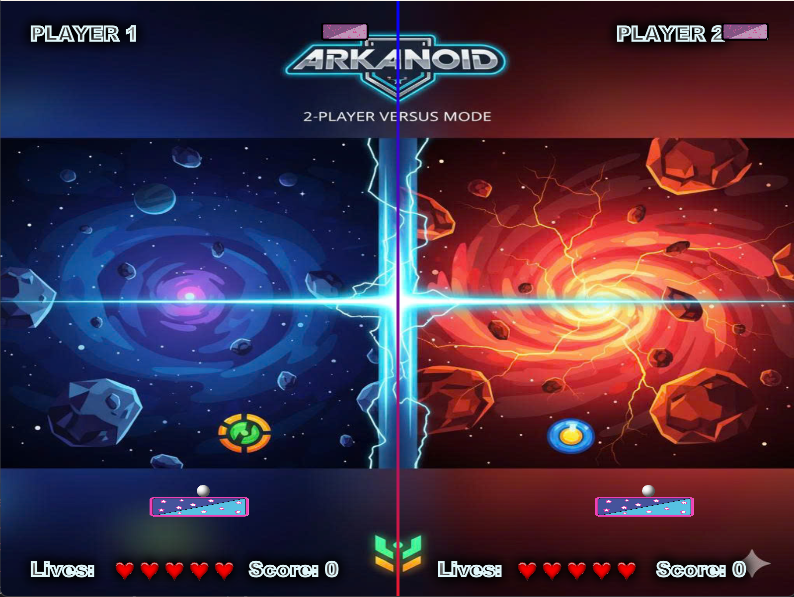
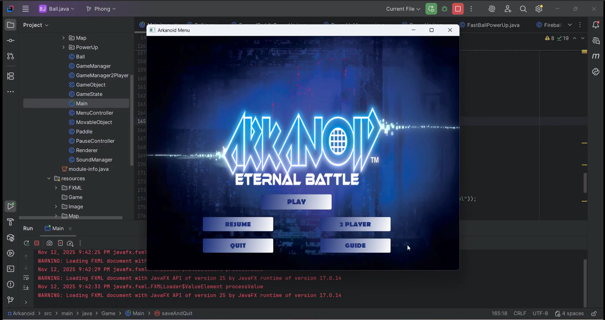

# Arkanoid Game - Object-Oriented Programming Project

## Author
Group mkdir - Class INT2204_6
1. Hoàng Hải Phong - 24020267
2. Nguyễn Trọng Phúc - 24020276
3. Nguyễn Khắc Hải Lâm - 24020195
4. Võ Trần Hoàng Long - 24020213

**Instructor**: Kiều Văn Tuyên
**Semester**: HK1 - 2025

---

## Description
This is a classic Arkanoid game developed in Java as a final project for Object-Oriented Programming course. The project demonstrates the implementation of OOP principles and design patterns.

**Key features:**
1. The game is developed using Java 24 with JavaFX/Swing for GUI.
2. Implements core OOP principles: Encapsulation, Inheritance, Polymorphism, and Abstraction.
3. Applies multiple design patterns: Singleton, Factory Method, Strategy, Observer, and State.
4. Features multithreading for smooth gameplay and responsive UI.
5. Includes sound effects, animations, and power-up systems.
6. Supports save/load game functionality and leaderboard system.

**Game mechanics:**
- Control a paddle to bounce a ball and destroy bricks
- Collect power-ups for special abilities
- Progress through multiple levels with increasing difficulty
- Score points and compete on the leaderboard

---

## UML Diagram

### Class Diagram

---

## Design Patterns Implementation

### 1. Singleton Pattern
**Used in:** `PowerUpManager`, ``, ``

**Purpose:** Ensure only one instance exists throughout the application.

---

## Installation

1. Clone the project from the repository.
2. Open the project in the IDE.
3. Run the project.

## Usage

### Controls
| Key  | Action                    |
|------|---------------------------|
| `←`  | Move paddle left          |
| `→`  | Move paddle right         |
| `SPACE` | Launch ball / Shoot laser |
| `ESC` | Pause game and Save game  |

### How to Play
1. **Start the game**: Click "PLAY" or "2 PLAYER" from the main menu.
2. **Control the paddle**: Use arrow keys or ←|→ to move left and right./If 2 player, use A|D and ←|→
3. **Launch the ball**: Press SPACE to launch the ball from the paddle.
4. **Destroy bricks**: Bounce the ball to hit and destroy bricks.
5. **Collect power-ups**: Catch falling power-ups for special abilities.
6. **Avoid losing the ball**: Keep the ball from falling below the paddle.
7. **Complete the level**: Destroy all destructible bricks(not unbreak brick) to advance.

### Power-ups
| Icon | Name | Effect                                    |
|------|------|-------------------------------------------|
| 🟦 | Expand Paddle | Increases paddle width for 10 seconds     |
| ⚡ | Fast Ball | Increases ball speed by 2                 |
| 🎯 | Multi Ball | Spawns 2 additional balls                 |
| 🔥 | Fire Ball | Ball passes through bricks for 10 seconds |

### Scoring System
10 points /brick's hp

Each type of brick has a different amount of HP. When hit by the ball, it loses 1 HP and changes color until it breaks.

---

## Demo

### Screenshots

**Main Menu**  

**Gameplay**  
 

**Power-ups in Action**  

### Video Demo

---

## Future Improvements

### Planned Features

1. **Enhanced gameplay**
    - Boss battles at end of worlds
    - More power-up varieties (freeze time, shield wall, etc.)
    - Achievements system

2. **Technical improvements**
    - Migrate to LibGDX or JavaFX for better graphics
    - Add particle effects and advanced animations
    - Implement AI opponent mode
    - Add online leaderboard with database backend
    - Add multithread

---

## Technologies Used

| Technology | Version | Purpose |
|------------|---------|---------|
| Java       | 24      | Core language |
| JavaFX     | 19.0.2  | GUI framework |
| Maven      | 3.9+    | Build tool |
| Gson       | 2.13.2  | Save game|

---

## License

This project is developed for educational purposes only.

**Academic Integrity:** This code is provided as a reference. Please follow your institution's academic integrity policies.

---

## Notes

- The game was developed as part of the Object-Oriented Programming with Java course curriculum.
- All code is written by group members with guidance from the instructor.
- Some assets (images, sounds) may be used for educational purposes under fair use.
- The project demonstrates practical application of OOP concepts and design patterns.

---

*Last updated: [12/11/2025]*
